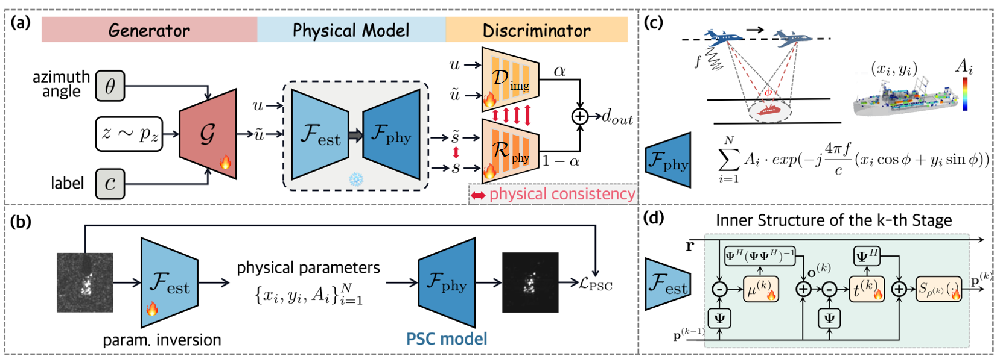

$\Phi$-GAN: Physics-Inspired GAN for Generating SAR Images Under Limited Data
==== 
1.Introduction  
------- 
This project is for paper [$\Phi$-GAN: Physics-Inspired GAN for Generating SAR Images Under Limited Data](https://openaccess.thecvf.com/content/ICCV2025/papers/Zhang_Ph-GAN_Physics-Inspired_GAN_for_Generating_SAR_Images_Under_Limited_Data_ICCV_2025_paper.pdf).

### 1.1 Features


The proposed $\Phi$-GAN framework overview.


### 1.2 Contribution
* A physics-inspired GAN framework, $\Phi$-GAN, is proposed for SAR image generation, aiming to improve training stability and generalization under data-scarce conditions.
* $\Phi$-GAN consists of a physics-inspired neural module for PSC parameter inversion and two specialized physical loss functions for training regularization.
* Extensive experiments are conducted on diverse SAR image generation tasks. Built upon multiple existing conditional GAN architectures, the proposed $\Phi$-GAN consistently demonstrates strong adaptability, improved generalization, and robust generation performance.


2.Getting Started
------- 
### 2.1 Data
MSTAR dataset is used in the experiments. Dictionary and pre-trained weights for physics-inspired neural module can be downloaded from the link https://drive.google.com/drive/folders/1Yl_eupJBl1P_1CNB9q4i4xXlxJbPPRvc?usp=sharing. 


### 2.2 Training
To train a $\Phi$-GAN model, run the following command:
```
python train.py \
   --bs 32 \
   --lrg 0.0001 \
   --lrd 0.0001 \
   --num_epochs 2000 \
   --save_dir ${SAVE_PATH} \
   --train_txt 'train.txt'\
   --d_mat 'D_80*80_image_domain.mat'\
   --d_h_mat 'D_80*80_image_domain_H.mat'\
   --inv_d_mat 'D_80*80_image_domain_Inv_norm.mat'\
   --f_est 'HQS_epoch_30.pth'
```
### 2.3 Generating
After training stage, run the following command to generate SAR target images with given label and angle information.
```
python generate.py
```

3.Citation
------- 
If you find this repository useful for your publications, please consider citing our paper.

```
@inproceedings{zhang2025ph,
  title={Ph-GAN: Physics-inspired GAN for generating SAR images under limited data},
  author={Zhang, Xidan and Zhuang, Yihan and Guo, Qian and Yang, Haodong and Qian, Xuelin and Cheng, Gong and Han, Junwei and Huang, Zhongling},
  booktitle={Proceedings of the IEEE/CVF International Conference on Computer Vision},
  pages={29075--29085},
  year={2025}
}
```
